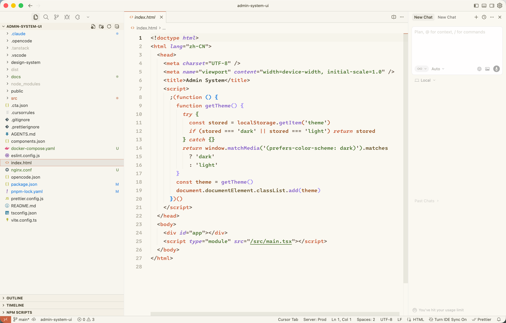
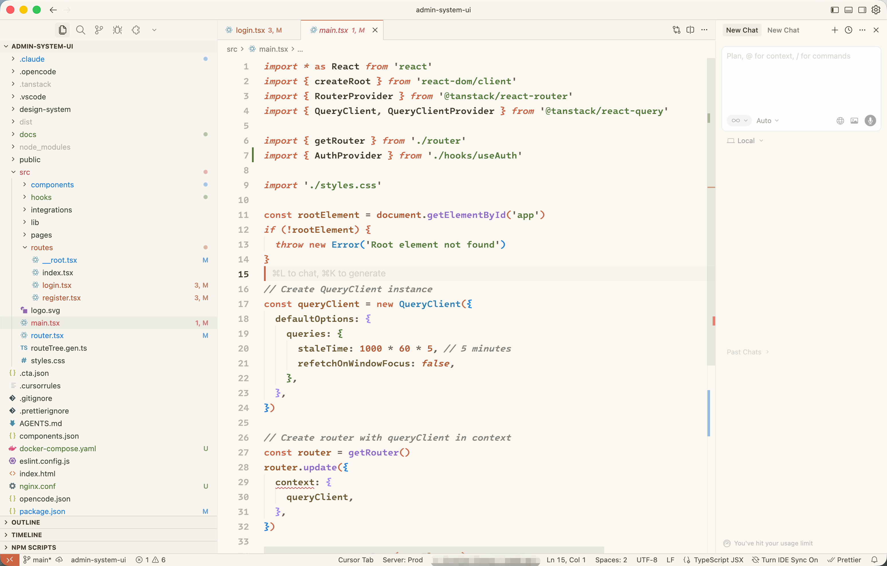
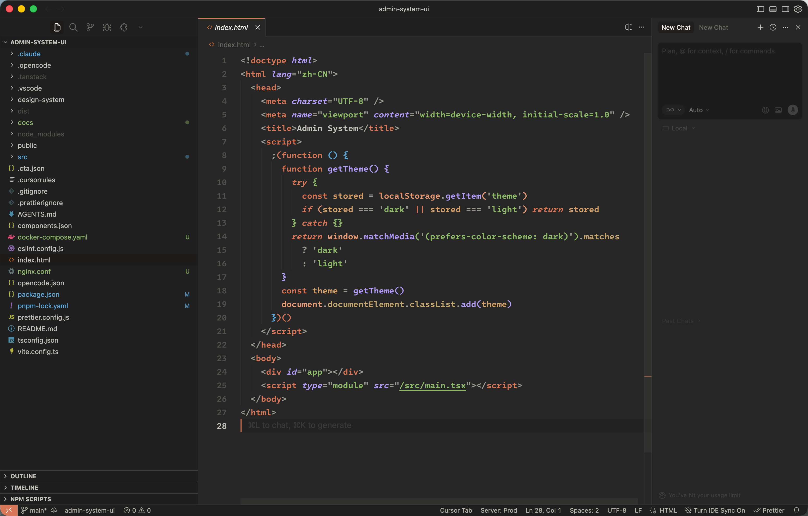
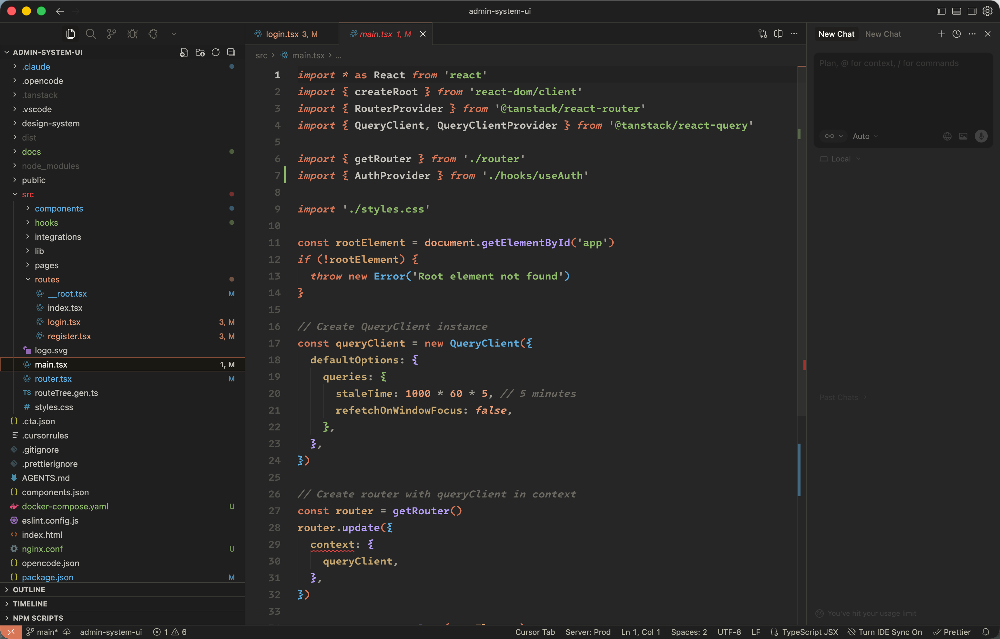

# Claude Theme

A color themes inspired by Claude — available in **Light** and **Dark** variants with warm, readable colors and clear syntax highlighting.

> **⚠️ Work in progress (WIP)** — This theme is still under development; colors and syntax highlighting may change between versions.

## Features

- **Claude Light** — Cream background, warm brown text, and balanced accent colors
- **Claude Dark** — Soft dark gray background with coral and blue accents
- **Claude Light (Experimental)** / **Claude Dark (Experimental)** — Alternative color palettes still being tuned; try these if you want to preview upcoming changes or prefer a different balance of contrast and hues.

## Installation

**From VS Code Marketplace** (when published):

1. Open **Extensions** (`Ctrl+Shift+X` / `Cmd+Shift+X`).
2. Search for **Claude Themes by Zhangcy** and click **Install**.

## How to Use

1. Open the Command Palette (`Ctrl+Shift+P` / `Cmd+Shift+P`).
2. Run **Preferences: Color Theme**.
3. Choose **Claude Light**, **Claude Dark**, or one of the **Experimental** variants.

## Screenshots

### Light theme

| HTML | TSX |
|------|-----|
|  |  |

### Dark theme

| HTML | TSX |
|------|-----|
|  |  |

## License

MIT